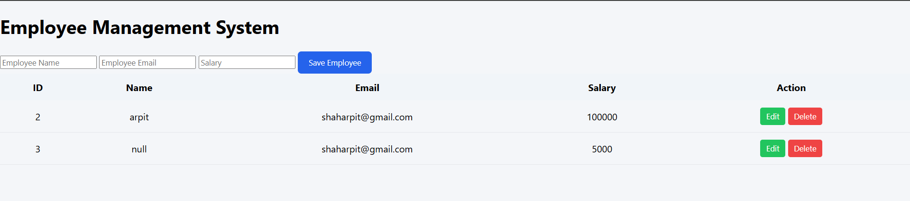

# Employee Management System

Employee Management System is a web-based application developed using Spring Tool Suite (STS). It enables adding, updating, deleting, and managing employee details such as name, email, and salary through a simple dashboard. The project uses CRUD operations with database integration and is currently under active development.

---

## 🚀 Features
- Add Employee
- Update Employee
- Delete Employee
- View Employee List
- User Authentication (Login/Register)
- Database Integration (MySQL)

---

## 🛠 Technologies Used
- Java
- Spring Boot
- Spring Data JPA
- HTML
- CSS
- JavaScript
- MySQL
- Maven

---

## 📸 Project Screenshot

---

## 📌 Future Improvements
- Role-based authentication
- Salary calculation module
- Attendance management
- REST API integration

---

## 👨‍💻 Author
**Arpit Shah**
GitHub: https://github.com/Arpit-30
